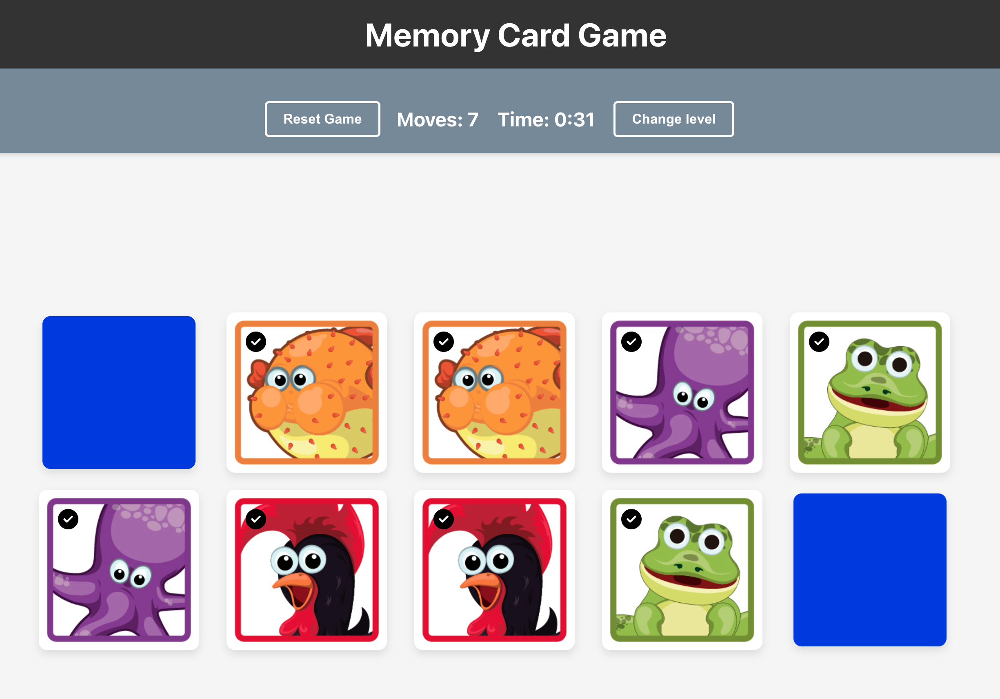

# Memory Card Game

This project is a challenge designed for the Zicasso evaluation process.

- [📄 Challenge Brief](./brief.md)
- [🚀 Live Demo](https://ddalairac.github.io/front-end-assessment/)



## Personalization (Additional Features)

- Production Build Optimization
- SEO Optimization
- GitHub Pages Deployment
- State Management
- Difficulty Levels (Easy, Medium, Hard)
- Scoring System
- Game Timer
- Modal (Start/Success)
- Animations
- Extensive Unit Testing
- Responsive Design
- Browser console cover


## Dependencies

### Original Dependencies (from fork)

- **React**
- **TypeScript**
- **Vite**

### Added Dependencies

- **Sass**: CSS preprocessor for styling
- **Zustand**: State management library for handling game state
- **gh-pages**: For easy deployment to GitHub Pages
- **Vitest**: Test runner and framework optimized for Vite projects
- **React Testing Library**: Utility for rendering and testing React components from a user perspective (render, screen, fireEvent)
- **Terser**: JavaScript minifier for better production builds

## Architecture

This project implements a clean architecture based on:

- **Presentational Components**: The UI components (Card, CardGrid, Header) are purely presentational and only responsible for rendering the data they receive via props.
- **State Management Separation**: All game logic and state management is centralized in the Zustand store, completely separated from the UI components.
- **Unidirectional Data Flow**: Data flows down from the store to the components, and actions flow up from components to the store.

This separation of concerns makes the codebase more maintainable, testable, and easier to understand.

## Development

Run the project locally:

```bash
# Install dependencies
npm install

# Start development server
npm run start
```

Run the build locally:

```bash
# Install dependencies
npm run build

# Start development server
npm run preview
```

Run produccion build locally:

```bash
# Build aplication
npm run build

# Server from build
npm run preview
```

## Deployment

The game is deployed to GitHub Pages using the gh-pages package:

```bash
# Deploy to GitHub Pages
npm run deploy
```

## Unit Testing

Run unit tests

```bash
# To run the tests:
npm run test

# To run the tests & listen to changes
npm run test:watch
```
